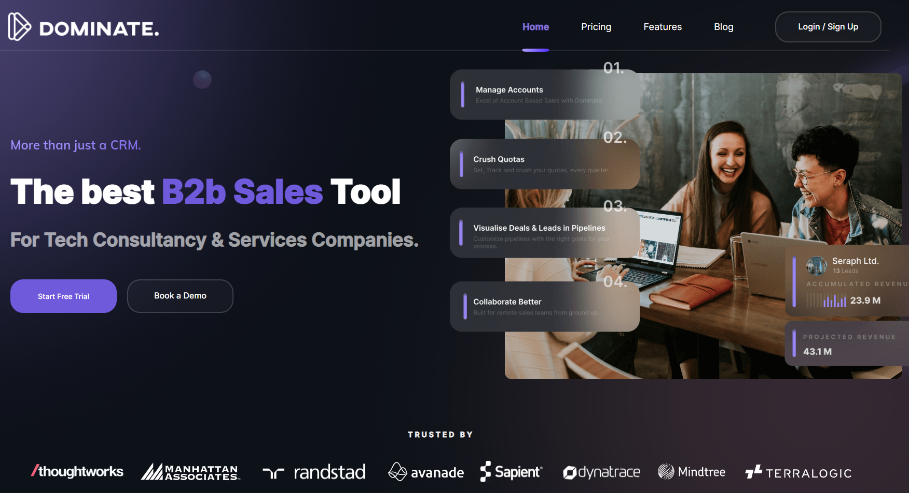

<h1> Dominate A.I. - The world's best Open Source CRM for High Ticket B2B Sales - </h1>
<h2> [Visit Website](https://dominateai.github.io/dominate-landing-page-website/) </h2>
<p>
	
[](https://www.linkedin.com/company/dominate-ai/?viewAsMember=true)

[](https://www.instagram.com/dominate.ai/?hl=en)

	
</p>

<h3> Technologies Used </h3>


  
  
  


Dominate A.I. is designed for businesses where every deal counts—perfect for high-ticket sales with long sales cycles and account-based selling strategies. Whether you’re a tech company managing SaaS clients or a consultancy nurturing high-value partnerships, Dominate A.I. empowers your team to stay organized and close deals faster.  

## Features  
- **Lead Management:** Organize and track leads with ease, ensuring no potential opportunity is overlooked.  
- **Deal Pipelines:** Visualize your sales process and monitor the progress of every deal.  
- **Follow-Up Scheduling:** Set reminders to follow up with prospects at the right time, so you never miss a touchpoint.  
- **Account Tracking:** Manage and view key details of all your accounts in one place for better relationship building.  
- **Task Management:** Stay on top of your to-dos with an intuitive task manager built for sales workflows.  
- **Customizable CRM:** Fully open source, giving you the flexibility to tailor features to your unique business needs.  

Start dominating your sales process with **Dominate A.I.** today!




# Dominate A.I. - Backend

## Local Development Setup

### **Option 1: Manual Setup**

1.  Install **NVM** and set up **Node.js** version `16.20.2`.
    
2.  Install necessary system dependencies:
    
    -   `build-essential`
    -   `node-gyp`
3.  Install `concurrently` globally for managing multiple processes:

```npm install -g concurrently```

4. Start the required services using Docker:

-   MongoDB (port `27017`)
-   Redis (port `6379`)
-   MinIO (ports `9000` and `9001`)

Example command to run MinIO:

```docker run -d --name minio -p 9000:9000 -p 9001:9001 \
  -e "MINIO_ROOT_USER=minioadmin" \
  -e "MINIO_ROOT_PASSWORD=minioadmin" \
  bitnami/minio:latest```

5.  Access the MinIO web console:
    
    -   URL: `http://localhost:9001`
    -   Login credentials:
        -   Username: `minioadmin`
        -   Password: `minioadmin`

6. Navigate to the root directory of the backend project and run the local server:
``npm run local``

7. Verify the logs for successful connections to MongoDB and Redis. If you encounter errors related to S3 or socket hang-ups, check the MinIO service configuration.

### **Option 2: Automated Script**

1.  Navigate to the root directory of the backend project.

2.  Make the startup script executable:
``chmod +x config/local_containers_setup/start_containers.sh``

3. Run the script to start all required containers and the Node.js server:
``./config/local_containers_setup/start_containers.sh``

4. Once development is complete, clean up the containers by running:
``chmod +x config/local_containers_setup/cleanup_containers.sh
./config/local_containers_setup/cleanup_containers.sh``

### **Option 3: Docker Compose**

1.  Use Docker Compose to set up the entire environment:
``docker-compose -f docker-compose-dev.yml up -d``

2. This starts MongoDB, Redis, MinIO, and the Node.js project inside Docker containers.

3. To scale the service:
``docker-compose -f docker-compose-dev.yml up --scale dominate=3 -d``

4. To stop and clean up the containers:
``docker-compose -f docker-compose-dev.yml down``

## Production Setup

1.  Install Docker and Docker Compose.

2.  Copy the frontend `dist` folder to `/var/dominate/dist/dominate-frontend/`.

3.  Build and start the production environment:
``docker-compose build``  
``docker-compose up --scale dominate=2 -d``

## Invite Flow

1.  Send an invite using the `POST /api/users/invite` API:  
    Example:
  ``  {
  "recipients": ["email1@example.com", "email2@example.com"]
}``

2. Recipients will receive an invite email with a link.

3. The invite link leads to a page where the user can verify their invite using the `GET /public/authCode/verify` API.

4. Upon successful verification, a new user can be created using the `POST /public/user` API with the necessary details.

## Database Initialization

To initialize the database:

1.  Ensure MongoDB is installed and running.

2.  Execute the following script:
``./scripts/init_dominate.js``

# Dominate A.I. - Frontend

## Local Setup

1.  Ensure Redis and MongoDB are running in the background.

2.  Clone the repository:
``git clone https://github.com/DominateAi/Dominate-AI.git``

3. Navigate to the frontend folder and install dependencies:
``npm install``

4. Start the local development server:
``npm run local``

5. (Optional) Initialize the database before starting the server:
``./scripts/init_dominate.js``

## Production Setup

1.  Install Docker and Docker Compose.

2.  Copy the frontend `dist` folder to `/var/dominate/dist/dominate-frontend/`.

3.  Build and start the production environment:
``docker-compose build docker-compose up --scale dominate=2 -d``