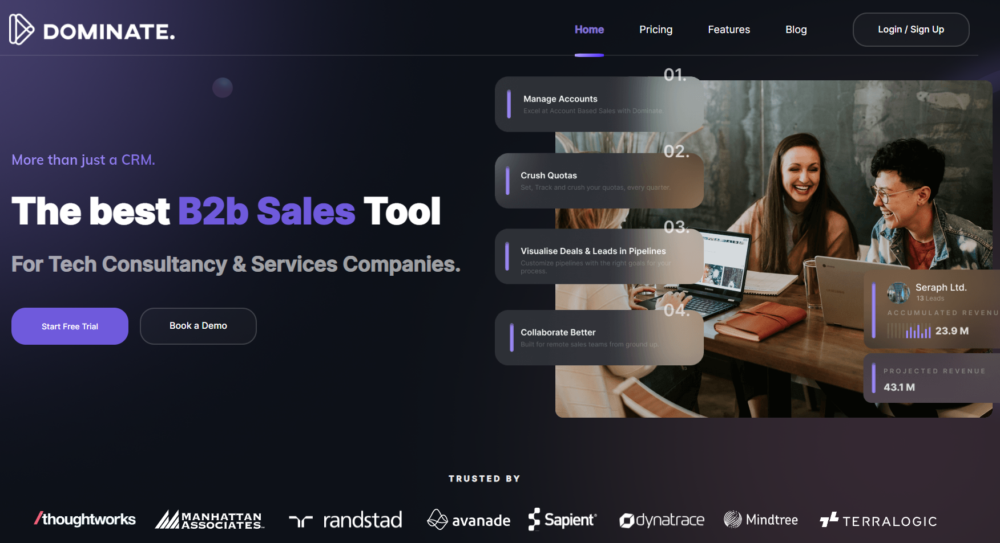
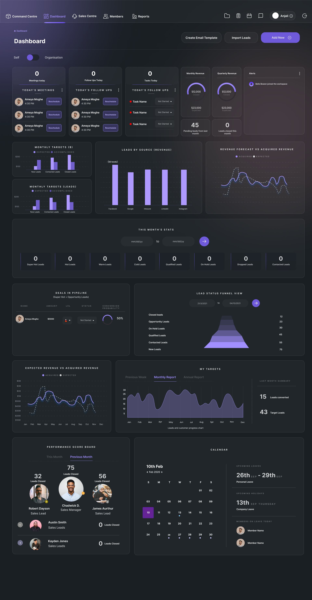

# Introduction

### Dominate A.I - The world's best Open Source CRM for High Ticket B2B Sales

Dominate A.I. is designed for businesses where every deal counts—perfect for high-ticket sales with long sales cycles and account-based selling strategies. Whether you’re a tech company managing SaaS clients or a consultancy nurturing high-value partnerships, Dominate A.I. empowers your team to stay organized and close deals faster.  

## Technologies Used

## Features  
- **Lead Management:** Organize and track leads with ease, ensuring no potential opportunity is overlooked.  
- **Deal Pipelines:** Visualize your sales process and monitor the progress of every deal.  
- **Follow-Up Scheduling:** Set reminders to follow up with prospects at the right time, so you never miss a touchpoint.  
- **Account Tracking:** Manage and view key details of all your accounts in one place for better relationship building.  
- **Task Management:** Stay on top of your to-dos with an intuitive task manager built for sales workflows.  
- **Customizable CRM:** Fully open source, giving you the flexibility to tailor features to your unique business needs.  

Start dominating your sales process with **Dominate A.I.** today!

## CLI Tools

Dominate A.I. provides command-line interface (CLI) tools for different operating systems to help you manage your development environment easily. These tools are available in the `cli-binaries` directory.
